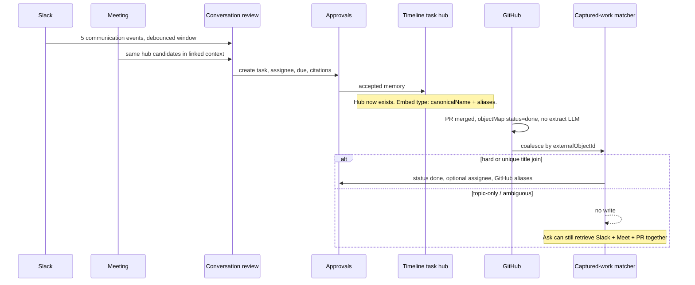
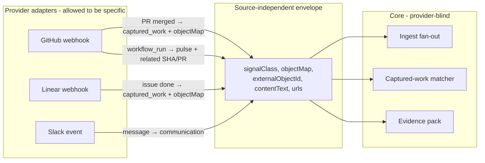
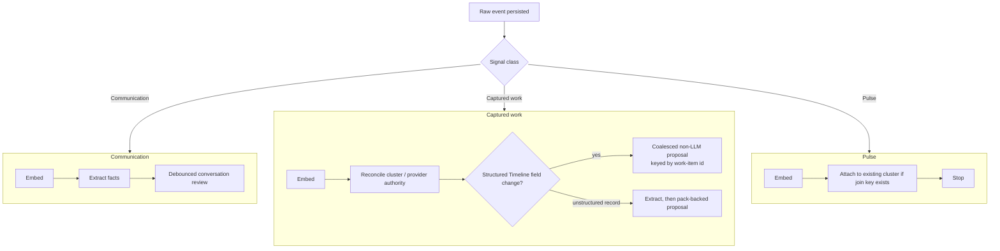
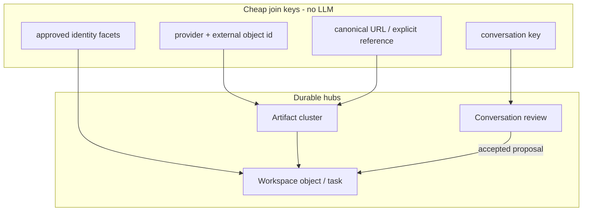
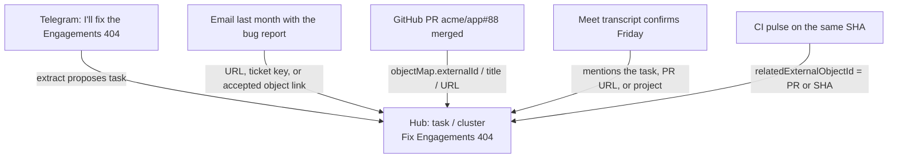
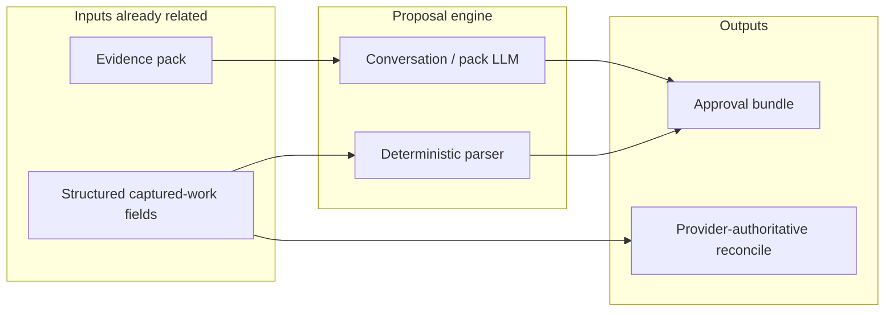
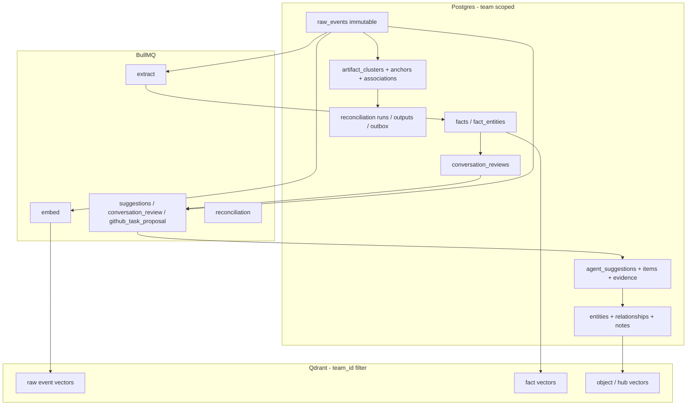

# Operating memory engine

**Status:** Living architecture contract. Sections mark **Shipped** vs
**Target**. Code that disagrees with a Shipped rule is a bug. Code that
disagrees with a Target rule is unfinished work, not a license to invent a
fourth model.

**Audience:** Product, engineering, and anyone changing ingest, proposals,
retrieval, or object memory.

**Last updated:** 2026-08-17

This is the single narrative for how Timeline turns mixed source events into
durable workspace memory. Decision records stay in ADRs. Object UI, routes, and
schema history stay in [`objects.html`](./objects.html). Pack rollout gates stay
in [`cross-source-evidence.md`](./cross-source-evidence.md). If those pages
restate this engine, they are stale.

Glossary terms live in [`CONTEXT.md`](../CONTEXT.md). Use them.

## Docs package

Read in this order. Do not grow a second engine narrative.

1. **This file** — how data moves and when memory may change.
2. [`product-brief.html`](./product-brief.html) — why the product exists.
3. [`objects.html`](./objects.html) — schema, routes, UI. Not the workflow.
4. [`cross-source-evidence.md`](./cross-source-evidence.md) — pack rollout
   gates and website copy only.
5. ADRs in `docs/adr/` — frozen decisions. Start at 0003, 0004, 0005, 0014.
6. [`todo.md`](../todo.md) — open work.

Deleted: `docs/cross-source-evidence-implementation-plan.md`. The builder is
code-complete; remaining work is rollout, listed in the pack page and
[`todo.md`](../todo.md).

## On this page

- [The question this engine exists to answer](#the-question-this-engine-exists-to-answer)
- [Thesis](#thesis)
- [Layers](#how-to-read-the-rest-of-this-file)
- [Cost, quality, and distance](#cost-quality-and-distance-from-ideal)
- [Shipped vs target](#what-is-shipped-vs-target)
- [Non-negotiables](#non-negotiables)

## The question this engine exists to answer

Five historical evidence items (Slack, Telegram, a meeting, an email, a note)
become an approved Timeline task with an assignee and a due date. Weeks later a
GitHub PR merges. Its description says the issue is solved.

**Does that become a `status: done` proposal?**

Only if the PR can **attach to that task as a hub**. Topic similarity is not
enough. "Looks related" is Ask, not a write.

| What the later PR actually contains | Shipped | Target |
| --- | --- | --- |
| Hard join: same GitHub id already on the task (`metadata.integration_external_id`), cluster `canonicalEntityId`, or an alias such as `PR-acme/app-88` / `acme/app#88` | **Yes.** Coalesced non-LLM `done` (and assignee if the task has none) | Same, via envelope `objectMap`, not `github.type` |
| Unique title match: the open task's name/aliases mention that repo **and** `#88` / `PR #88`, and titles align, and no other open task also matches | **Yes**, one fuzzy hit | Same; still refuse if two tasks match |
| PR body says "fixed the Engagements 404" / "this issue is solved", task is titled "Fix Engagements 404", no repo, number, URL, or alias overlap | **No.** Matcher never runs on prose similarity | Embeddings may **recall** the task. A second qualify step (unique title, explicit ref, or one pairwise confirm on a shortlist) may propose a **link**, then `done`. Cosine alone never writes |
| CI run, review comment, or Sentry spike on the same SHA | **No.** Not a captured-work work item | Pulse **attaches** to the PR/SHA hub. Still never originates `done` |
| The 5-item task proposal is still pending; nobody accepted it | **No.** Matcher only sees open `entities` rows | Pending create and later captured work **merge/supersede** into one bundle (`create` already `done`, or create + `status: done`) |

The five source events do not get dumped into a second LLM when the PR arrives.
They already created the hub. The PR is structured captured work: parse
`objectMap.status`, match the hub, write an approval bundle cited to **that PR
event**. Assignee and due date already on the task stay unless the new evidence
carries those fields and policy allows them to move (today: GitHub may fill
empty assignee/owner; it does not touch due).



## Thesis

1. **Classify the event, not the OAuth app.** A GitHub merged PR is captured
   work. A GitHub workflow run is a pulse. A review comment is
   communication-lite attached to captured work.
2. **Relations attach to shared hubs, not to a surface.** Telegram, a PR, a
   meeting, and last month's email meet because they point at the same task,
   project, person, or artifact cluster.
3. **LLMs read bounded packs of already-related evidence.** They do not discover
   the graph by concatenating sources. Embeddings recall candidate hubs. They
   do not prove a write.
4. **Durable inferred memory stays approval-backed.** A provider may update
   fields it authoritatively owns. Timeline-owned tasks, notes, owners, and
   object memory do not silently rewrite themselves from a webhook.

```text
capture surfaces
       |
       v
 immutable raw events
       |
       v
 signal class + cheap processing
 persist, embed, hard-anchor
       |
       v
 relation graph
 clusters, objects, conversations, provider ids
       |
       v
 bounded evidence pack
 visibility-safe, one-hop, budgeted
      /        \
 answers      proposals
 retrieval    durable writes
      |
      v
 accepted workspace objects
 the hubs later events attach to
```

## How to read the rest of this file

The engine is seven layers. Data moves downward. Writes never skip a layer.

| Layer | What it is | What it is allowed to do |
| --- | --- | --- |
| 1. Capture | Adapters turn provider payloads into an envelope | Be provider-specific |
| 2. Persist | Immutable `raw_events` | Never update captured content |
| 3. Classify + fan-out | Signal class chooses jobs | Spend or refuse LLMs |
| 4. Graph | Hubs, clusters, conversations, ids, URLs | Attach; do not invent objects from pulses |
| 5. Pack | Visibility-safe related evidence | Read; not authority |
| 6. Proposal | Conversation LLM or captured-work parser | Cite exact events; wait for a human |
| 7. Object memory | Accepted `entities` and relationships | Canonical until a new accepted proposal |

ADRs record why a layer exists. This file records how they run together.

- [ADR 0003](./adr/0003-object-memory-is-approval-backed-workspace-state.md) —
  inferred memory is visible workspace state
- [ADR 0004](./adr/0004-conversation-reviews-drive-conversational-proposals.md) —
  conversations do not mint tasks from one message
- [ADR 0005](./adr/0005-workspace-reconciliation-is-artifact-centered-and-approval-backed.md) —
  clusters are the consistency boundary
- [ADR 0006](./adr/0006-object-relationship-proposals-use-bundle-local-refs.md) —
  create+link in one bundle
- [ADR 0010](./adr/0010-artifact-provenance-is-tiered-and-evidence-backed.md) —
  why it exists / what changed it / related evidence
- [ADR 0014](./adr/0014-cross-source-evidence-packs-use-policy-bound-related-evidence.md) —
  pack admission vs ranking

## Layer 1 — Source-independent envelope

The core must not switch on `provider === 'github'`. GitHub-specific parsing
belongs in the GitHub adapter. Independence is preserved when every adapter
emits the same envelope.

The envelope already exists as `IntegrationEvent` + optional `ObjectMapping` in
`packages/shared/src/integrations/types.ts`.

| Field | Independent meaning | GitHub PR | GitHub CI |
| --- | --- | --- | --- |
| `signalClass` (**Target**) | Spend and proposal rights | `captured_work` | `pulse` |
| `objectMap` | Durable work record, if any. Does **not** create a Timeline task | `type=task`, `externalId=repo#88`, `status=done` | absent |
| `externalObjectId` | Stable subject of this event | `acme/app#88` | `acme/app#workflow_run:123` |
| `relatedExternalObjectId` (**Target**) | Work item this pulse attaches to | — | PR or SHA when known |
| `contentText` | Human-facing narrative to embed | `GitHub PR acme/app#88 — Fix Engagements 404` | `GitHub workflow CI #12 failed on acme/app` |
| `url` / aliases | Cross-source join bait | PR URL, `PR-acme/app-88` | workflow URL, `head_sha` |
| `dedupKey` | Idempotent persist | webhook replay is a no-op | same |

`objectMap` is a reconciliation hint. The event-writer uses it for artifact
anchors and associations. It does not insert or update `entities`. Timeline
tasks appear only when a human creates them or accepts a proposal.



Writing `if (github.type === 'pull_request')` in the suggestion worker is what
destroys independence. Writing it once in `providers/github.ts` is the adapter
doing its job.

## Layer 2 — Immutable persist

Every selected event becomes a `raw_events` row, team-scoped, visibility-tagged.
Captured content does not get `UPDATE`d. Derived facts, associations, rankings,
and proposals may change. Calendar raw-event rows are the documented exception:
they are derived schedule mirrors and may refresh timeline text when the owning
calendar event changes.

Team isolation is sacred. Every Postgres query goes through `withTeam`. Every
Qdrant query filters on `team_id`.

## Layer 3 — Signal class and ingest fan-out

Class is a property of the **event**, not the OAuth app.

| Class | What it is | Examples | Default jobs |
| --- | --- | --- | --- |
| **Communication** | People talking, deciding, committing | Slack/Telegram threads, meetings, email, voice notes, PR review discussion | Persist, embed, extract facts, conversation review |
| **Captured work** | A durable work record or lifecycle change | Merged PR, closed issue, Linear/Jira status, Monday item, CRM call log, signed contract | Persist, embed, reconcile; structured proposal only when Timeline memory should move |
| **Pulse** | Telemetry that can explain or impact work | CI runs, Sentry events, deploy pings, noisy issue-alert repeats | Persist, embed, attach as supporting evidence; never originate a proposal |

Unstructured captured work (a CRM call log) may still extract. Structured
captured work (PR merged, Linear state) must not. Pulses never extract.

**Shipped:** skip extract/suggestion LLM for providers `github | linear | monday | sentry`.
**Target:** stamp `signalClass` on the envelope so a GitHub PR and a GitHub CI
run diverge without a provider skip list.



Coalescing is by **work-item id**, not by clock. A burst of PR events for
`acme/app#88` collapses into one delayed job that loads the latest team-visible
event for that id. Unrelated PRs in the same minute do not share a prompt.

Per-connection Redis token buckets sit in front of extract, embed, and coalesced
proposal jobs. They are a fuse, not a classifier.

## Layer 4 — Relation graph and work hubs

Same-surface keys are how an event finds a hub. They are not themselves the
story.



### How a cross-source story actually links



Attach cheapest first:

1. **Explicit reference.** A URL, `acme/app#88`, `ENG-42`. Parse without an LLM
   when the pattern is stable.
2. **Object already exists.** Communication extract created a task last week.
   Captured work later matches it by provider id, alias, or a unique title.
3. **Deterministic rendered titles.** Embed `task: acme/app#88: Fix Engagements
   404`, not webhook JSON.
4. **Vector recall, then qualify.** Embeddings retrieve candidates. A second
   step must qualify: shared object, shared URL, unique title, or one pairwise
   "are these the same work item?" check on the shortlist. Never promote cosine
   similarity alone into a durable link.

A qualifying relationship for a **proposal pack** is direct and one-hop
([ADR 0014](./adr/0014-cross-source-evidence-packs-use-policy-bound-related-evidence.md)):
same conversation, canonical artifact or object association, provider or
external id, canonical URL, or a human-curated object link. A model-extracted
fact may create a candidate. It cannot qualify that candidate by itself.

## Layer 5 — Evidence packs

A pack is a bounded, visibility-safe read of already-related evidence. It is
not a new source of truth.

| Consumer | Admission | Why |
| --- | --- | --- |
| Proposal pack | Direct one-hop only | A weak similarity must not rewrite memory |
| Answer pack | Viewer-visible semantic matches allowed, labeled as retrieval | Questions need recall; they do not change canonical state |
| Digest / handoff | Pack plus typed adjacent objects, tasks, calendar | Generated communication is cited memory |

**Shipped:** builder exists; `CROSS_SOURCE_EVIDENCE_MODE` defaults to `off`.
Generic ingest webhooks can shadow/enforce. Slack/Telegram still use the
conversation-review window. Agent Ask already returns an answer-policy pack for
raw-event evidence.

**Target:** every proposal consumer reads a pack. Conversation reviews migrate
onto proposal-policy packs. Pulses enter only as supporting evidence when a
hard join already exists.

Rollout gates and website-copy rules live in
[`cross-source-evidence.md`](./cross-source-evidence.md).

## Layer 6 — Proposal engine

Proposals are how inferred Timeline memory moves. They are not how providers
update fields they own.



Rules:

- **Communication** proposes through a conversation review (and, once migrated,
  a proposal-policy pack). Isolated Slack messages do not mint tasks.
- **Captured work** proposes only when a Timeline-owned field should change
  (task `done`, assignee, aliases). Provider-owned cluster status can move
  without a suggestion model.
- **Pulses** never originate bundles. They may appear as supporting citations
  inside a pack started by communication or captured work.
- Every proposed item names exact raw-event ids from the supplied pack or the
  structured source event. Empty, hidden, or invented citations invalidate the
  bundle.
- Accepted memory is canonical until a new proposal is accepted. Pending
  bundles may merge or supersede as related evidence arrives.

Vectors do not sit on this write path as a join key. Stored embeddings may
tie-break already-qualified pack candidates.

### Communication path — how five events become one task

**Shipped.**

1. Slack/Telegram/meeting/email rows persist as communication.
2. Extract pulls facts and entity mentions. It does not create the task.
3. If the event has a conversation identity and is team-visible, schedule a
   conversation review: debounce ~10 minutes, window last 2 days / ≤24 events,
   plus ≤8 linked-context events that already share fact-linked entities.
4. One structured LLM call over that window proposes creates/updates
   (task, assignee, due, project edge, notes). Evidence quotes multiple
   `rawEventId`s from the window.
5. A teammate accepts in Approvals. That write creates the `entities` row —
   the hub. Category classification may run after accept.
6. Later communication in the same conversation can merge or supersede the
   pending bundle. It does not silently rewrite the accepted task.

### Captured-work path — how a later PR proposes `done`

**Shipped for GitHub PRs and issues. Target: any adapter that emits
`objectMap` + `signalClass=captured_work`.**

1. Adapter emits envelope with `objectMap.status` in `{done, cancelled, open}`.
2. Event-writer persists, embeds, reconciles the cluster, and enqueues a
   coalesced job keyed by `externalObjectId` (8s delay today).
3. Matcher loads the latest team-visible event for that id. Comments, reviews,
   commits, and CI never enter this matcher.
4. Match open **task** entities only (not done/cancelled/archived/merged):
   - hard: cluster `canonicalEntityId`, or
     `metadata.integration_provider=github` + `integration_external_id`, or
     alias overlap (`PR-acme/app-88`, `acme/app#88`, `PR #88`)
   - else unique fuzzy title: repo + number mentioned **and** titles align
   - multiple fuzzy hits → no proposal
5. Plan field changes: `status: done` for merged PR / closed issue;
   `cancelled` for closed-unmerged PR; assignee/owner only when the task has
   none and the GitHub login maps uniquely to a teammate; merge GitHub aliases
   onto the task.
6. Write an approval bundle citing that raw event. Human accepts. Now the hub
   carries GitHub aliases, so future pulses and PRs hard-match.

GitHub `objectMap` never creates the task. If the five-event proposal is still
pending, today's matcher has nothing to update. **Target:** merge that pending
create with the captured-work lifecycle so the human sees one bundle.

## Layer 7 — Object types and hub roles

Workspace objects are the durable hubs. Schema, routes, and UI live in
[`objects.html`](./objects.html). This table is how each type participates in
the engine.

Postgres enum `entity_type` / runtime `OBJECT_TYPES`:

| Type | Role in the engine | Typical status vocabulary |
| --- | --- | --- |
| `task` | Primary captured-work hub. GitHub/Linear lifecycle proposes status/assignee here | backlog · open · doing · blocked · done · cancelled |
| `follow_up` | Lighter commitment hub; conversation review may mint these | todo · doing · done · cancelled |
| `project` | Grouping hub. Optional primary-project edge from a task (`child`) | planning · active · on_hold · shipped · cancelled |
| `person` | Identity hub. Approved facets (email, GitHub login, Slack) map actors | open · active · archived |
| `company` / `vendor` | Account/org hub | open · active · archived |
| `deal` | CRM captured-work hub | open · qualified · proposal · won · lost |
| `incident` | Incident hub; Sentry pulses attach, they do not close it | open · mitigated · resolved · postmortem |
| `hiring_loop` | Hiring hub | sourcing · interviewing · offer · hired · closed |
| `decision` | Decision hub | draft · proposed · accepted · rejected |
| `document` | Curated document hub; captured files are not this until promoted | open · active · archived |
| `topic` / `other` | Weak extraction mentions; do not become hubs by default | open · active · archived |
| `link` | Runtime artifact type for shared URLs; not a first-class `entities` enum value in `OBJECT_TYPES` | — |

Shared fields that the engine cares about:

| Field | Engine use |
| --- | --- |
| `canonical_name` | Unique per `(team, type, lower(name))` among unmerged rows. Embedded as `type: canonicalName` |
| `aliases` | Hard join bait (`ENG-42`, `PR-acme/app-88`) |
| `metadata.integration_provider` + `integration_external_id` | Provider-id join |
| `status` / `stage` / `priority` / `due_at` | Lifecycle; captured work may propose a subset |
| `owner_user_id` / `assignee_user_id` | People; GitHub fills only when empty and login maps |
| `task_category*` | Derived, reversible ([ADR 0011](./adr/0011-task-category-is-reversible-derived-state.md)); not a join key |

Relationships (`entity_relationships`): `parent`, `child`, `related`, `blocks`,
`blocked_by`, `duplicate_of`. A task's primary project is task → project with
`kind='child'`. Create+link in one approval bundle uses `localRef`
([ADR 0006](./adr/0006-object-relationship-proposals-use-bundle-local-refs.md)).

### Artifact cluster vs workspace object

An artifact cluster can exist **before** a canonical object. A GitHub PR
cluster, a Sentry issue cluster, and a pending task approval can describe the
same real-world work. Evidence association is not authority: GitHub may mark
the cluster resolved (`direct_write`) without marking the Timeline task done.

Provenance tiers ([ADR 0010](./adr/0010-artifact-provenance-is-tiered-and-evidence-backed.md)):

1. Why the artifact exists (the five communication events, once accepted)
2. What changed it (the later PR `done` proposal, once accepted)
3. Related observed evidence (CI pulses, Sentry, drive-by comments)

### Authority matrix

| Field | Authoritative without Timeline approval | Needs a proposal |
| --- | --- | --- |
| Provider cluster status for the object the provider owns | That provider, via `objectMap` / reconciliation | — |
| Timeline task / follow_up / deal / incident status | Human edit | Communication review or captured-work matcher |
| Timeline assignee / owner | Human edit | Matcher may fill **empty** slots from a mapped actor |
| Timeline due date | Human edit | Communication review; GitHub does not set due |
| Aliases / external ids on a Timeline task | Human edit | Matcher may merge provider aliases after a qualified match |
| New Timeline object | Human create | Communication / unstructured captured-work proposal |
| Pulse-only telemetry | Never writes Timeline fields | May attach as related evidence |

Generic ingest webhooks are evidence-only
([ADR 0009](./adr/0009-ingest-webhooks-are-evidence-only.md)).

## Data stores



Raw events feed everything. Objects do not feed back into raw event content.
Embeddings are an index, not a store of record.

## Embeddings: recall, not a second source of truth

Do not LLM-summarize every event into a canonical paragraph just to make
Telegram and GitHub comparable. That is a second extract pass on the firehose.

| Source | Embed this | Extra LLM rewrite? |
| --- | --- | --- |
| Structured captured work | Deterministic `contentText` + `objectMap.canonicalName` | No |
| Pulse | Short `contentText` plus parent work-item id when known | No |
| Communication | Message or transcript (`renderRawEventForAi`) | No extra summarizer |
| Extracted facts | The fact statement | Reuse extract |
| Workspace objects / clusters | `type: canonicalName` plus aliases | No. This is the cross-source translator |

When extract already ran for communication, its fact statements **are** the
LLM-created embeddable text. Pay that cost once, on the class that earned it.

There is no cheaper option that still finds last month's email: index it. There
is a much more expensive option that still fails as a write key: summarize
every CI run and hope cosine equals "same work."

## Cost law

| Spend | Allowed | Forbidden |
| --- | --- | --- |
| Persist + visibility + source snapshot | All selected events | Dropping a selected source because it is noisy |
| Embed, rate-limited per connection | All selected events | Skipping embeddings for pulses so Ask cannot find them |
| Hard-anchor into a cluster / object | Any event with a stable id, URL, or conversation key | Creating a new object from a pulse |
| Extract LLM | Communication; unstructured captured work | Pulses; structured captured work |
| Suggestion / conversation-review LLM | Communication; pack-backed corrections | Pulses; parser-complete lifecycle fields |
| Structured non-LLM proposal | Captured-work field changes Timeline should review | Using this path for CI, Sentry, or comments |
| Answer LLM | Viewer-visible Ask / digest / handoff over a pack | Prompting with "last N events from this hour" |
| Ingest summarizer "for better embeddings" | Never | A second LLM on every event |

## Retrieval and generated communication

Ask, digests, and handoffs are readers of the same graph. Pulses are
first-class for Ask ("why did the release fail?") and for moment bundling.
They stay second-class for approvals.

The five historical events plus the later PR **should** appear together in Ask
once each is indexed, even when the matcher refused a `done` write. That is
labeled retrieval, not new memory.

## Worked example — full story

Slack: "I'll land the Engagements 404 fix in audit-ai today."
Meeting: confirms Friday.
Email from last month: original bug report with a URL.
GitHub: PR `timborovkov/audit-ai#88` merges, body says it fixes the 404.
Sentry: login crash in the same release spikes, then resolves.
CI: workflow runs go red, then green.

What must happen:

1. Conversation review proposes the task from Slack + meeting (+ email if a
   hard join or unique title already exists). Human sets or accepts assignee
   and due.
2. GitHub PR matches that open task (alias, provider id, or unique
   repo+number title). Coalesced `done` proposal. CI does not.
3. Sentry and CI attach to the PR/SHA cluster as pulses.
4. Later Ask loads Slack + meeting + PR + related Sentry. Never everything
   from Friday.

What must not happen:

- Extract every GitHub and Sentry row with "5 recent events" as context.
- Mark the task done because a workflow run finished in the same minute.
- Mark the task done because the PR body and the task title share the word
  "404" and nothing else.
- Assign the task to whoever connected GitHub.
- Drop Sentry so the later "why did this regress?" question has no evidence.
- Run a summarizer LLM on the CI firehose so it "embeds more like Slack."

## Cost, quality, and distance from ideal

This approach solves the issues we have been seeing **where a hard hub join
exists**. It does not magically close tasks from topic similarity, and it does
not yet stamp `signalClass` on every event.

### Does it fix the failures we saw?

| Failure | Status |
| --- | --- |
| GitHub / Sentry / Linear / Monday dumped into extract + suggestion LLMs | **Fixed for those providers.** `integrationSkipsLlmIngest` skips extract enqueue. The remaining leak is that skip is still an OAuth-app list, so a GitHub review thread cannot extract without turning CI extract back on. |
| Timeline tasks stay open after a merged PR | **Fixed when the task already carries a GitHub id, alias, or unique `repo#n` title.** Dogfood tasks titled only `PR #10` still miss: the matcher requires repo + number in the name/aliases. Pending (unaccepted) creates are also invisible to the matcher. |
| Extract used "5 recent team events" as context | **Fixed for structured providers** (they never call extract). **Still live** for Slack, Drive, email, meetings: `RECENT_CONTEXT_LIMIT = 5` in `apps/worker/src/workers/extract.ts` is a time-ordered team dump, not a conversation key. |
| GitHub assignee attributed to whoever connected the integration | **Fixed** for the GitHub matcher: login → person facet / unique name; connector is not the default. |
| CI / comments treated as work-item `done` | **Fixed** in the GitHub matcher (`githubKind` refuses comments/reviews/commits/CI). |
| Telegram + PR + Meet + last month's email as one write | **Designed, not finished.** Ask can retrieve them once embedded. A `done` write still needs a hub join. Packs default `off`. |

### Cost impact

The expensive call was **extract**, not suggestions. Structured ingest no
longer pays it.

| Spend | Direction |
| --- | --- |
| Extract + suggestion LLM on GitHub/Sentry/Linear/Monday firehose | **Down to zero** on those providers. Largest save. |
| Embed every selected event, including pulses | **Unchanged on purpose.** ~60 embeds/min/connection. Cheaper than extract; required for Ask. |
| Coalesced GitHub task proposals | **Parser only**, ~30 jobs/min/connection, 8s coalesce by work-item id. No model. |
| Ingest summarizer "for better embeddings" | **Not added.** That would be a second extract pass on the firehose. |
| Conversation extract + review | **Unchanged.** Still the correct paid path for Slack/Telegram/meetings. |
| Target: pairwise "same work item?" on a shortlist | **Rare, paid, off the firehose.** Only after recall when no hard join exists. |
| Evidence-pack ranking | **No extra embed.** Uses stored vectors as a tie-break (ADR 0014). |

Net: high-volume structured ingest becomes persist + embed + occasional
non-LLM proposal. Communication stays the LLM budget. Do not "save more" by
skipping pulse embeddings or we lose "why did the release fail?"

### Quality impact

| Better | Still weak until later slices |
| --- | --- |
| No false `done` from CI, comments, or "happened in the same minute" | Tasks created from chat without GitHub identity will not auto-close |
| Merged PR can close a Timeline task when aliases/ids exist | Conversation extract can still see 5 unrelated recent events |
| Assignee mapping is identity-based | Pack-backed conversation proposals are not shipped (`MODE=off`) |
| Pulses remain searchable | Core matcher still parses `github.type`; Linear/Jira cannot reuse it yet |
| Ask can show the full story without rewriting memory | Topic-only PR → task still must not become a silent write |

Quality improves by **refusing bad joins**, not by summarizing everything into
comparable prose.

### How far is the code?

Roughly **the ingest cost path is most of the way there; the join/quality path
is half; source independence and packs are the rest.**

| Slice | Code today | Remaining |
| --- | --- | --- |
| Skip extract/suggest on structured providers | Shipped as `STRUCTURED_INGEST_PROVIDERS` | Lift into `signalClass` on `IntegrationEvent` |
| GitHub PR/issue → coalesced task proposal | Shipped in `github-task-proposals.ts` | Stop parsing `github.type` in shared code; match `objectMap` + status for any adapter |
| Rate-limit extract/embed/proposal per connection | Shipped | Keep |
| Stamp GitHub aliases onto accepted chat tasks | Only after a successful match | Conversation review should copy `acme/app#88` when the window already said it — highest-leverage quality fix |
| Pending create + later PR as one bundle | Matcher sees only `entities` | Merge/supersede pending suggestion items |
| `relatedExternalObjectId` for CI/Sentry | `head_sha` in metadata | Envelope field + pulse attach |
| Evidence packs | Builder exists, default `off`; Ask uses answer packs | Enforce per adapter after gates in [`cross-source-evidence.md`](./cross-source-evidence.md) |
| Pairwise qualify after vector recall | Not started | Shortlist only; never cosine-as-write |
| Linear/Jira/CRM captured-work matcher | Not started | Falls out of envelope matcher |

Do not start the pairwise-qualify slice before alias stamping and pending-create
merge. Those two close most dogfood misses without a new model call.

## What is shipped vs target

| Piece | Today | Target |
| --- | --- | --- |
| Immutable ingest + team isolation | Shipped | Unchanged |
| Embed every selected integration event, rate-limited | Shipped | Unchanged |
| Skip extract/suggestion LLM for GitHub, Linear, Monday, Sentry | Shipped as a provider list | Replace with signal class + payload shape |
| Conversation review → approval-backed task create | Shipped | Migrate onto proposal packs |
| GitHub PR/issue lifecycle → coalesced task proposals | Shipped, GitHub-specific parser | Envelope-driven matcher on `objectMap` + status + aliases |
| Match pending create bundles when the PR arrives first | Not shipped | Merge/supersede with captured-work lifecycle |
| Topic-only PR → task `done` | Not shipped, and must not ship as cosine-write | Optional pairwise qualify after recall; still approval-backed |
| Artifact clusters + authority policy | Shipped | Pulses attach; they do not gain authority |
| Evidence-pack builder | Implemented, default off | Enforced per adapter after gates |
| First-class `signalClass` on ingest | Not shipped | Classifier at write time on the envelope |
| `relatedExternalObjectId` for pulses | Partial (`head_sha` in metadata) | Core envelope field |
| LLM rewrite of every event for embedding | Not done, and must not be | Reuse extract facts + object titles only |

## Non-negotiables

1. Classify by event, not by OAuth app. Core code reads the envelope, not
   `provider === 'github'`.
2. Do not use time windows or embedding similarity as proposal join keys.
   Embeddings recall; hubs qualify.
3. Pulses never originate proposals and never call extract.
4. Structured captured work never calls extract or the suggestion model.
5. Communication still requires a conversation review or pack, not one
   isolated message.
6. Team isolation and visibility apply before retrieval, ranking, model
   input, persistence, and display.
7. A pack supplies evidence, not authority.
8. Every proposed Timeline-owned change is approval-backed and cited.
9. Do not add a second LLM summarizer on ingest to make sources "more
   embeddable."
10. `objectMap` does not create Timeline tasks. Captured work updates hubs
    that already exist, or waits for a communication proposal to create them.

## Implementation seams

When code changes ingest or proposals, update this file in the same change.

- Envelope: `packages/shared/src/integrations/types.ts`
- Adapters: `packages/shared/src/integrations/providers/*.ts`
- Persist + fan-out: `packages/shared/src/integrations/event-writer.ts`,
  `ingest-processing.ts`
- Conversation reviews: `packages/shared/src/conversation-review/`
- Captured-work proposals: `packages/shared/src/integrations/github-task-proposals.ts`
  (first slice; target matcher is envelope-driven)
- Packs: `packages/shared/src/evidence-pack/`
- Objects: `packages/shared/src/objects/`
- Embeddings: `packages/shared/src/embedding/raw-event-renderer.ts`,
  `sources.ts`
- Rate limits: `packages/shared/src/rate-limit/buckets.ts`
  (`integrationExtract`, `integrationEmbed`, `integrationGithubTaskProposal`)

## Open work this contract implies

Detail and sequencing: [Cost, quality, and distance](#cost-quality-and-distance-from-ideal).
Highest leverage next: stamp PR aliases from conversation windows, then merge
pending creates with later captured work. Do not start pairwise qualify first.

- Lift the provider skip list into an event-level `signalClass` on the envelope.
- Replace GitHub-specific proposal parsing in shared code with an
  envelope-driven captured-work matcher.
- When a conversation window already names `acme/app#88`, stamp that alias on
  the proposed task so the later matcher can hard-join.
- Merge pending communication creates with later captured-work lifecycle.
- Treat GitHub review discussion as communication attached to a PR cluster.
- Set pulse parent ids (`relatedExternalObjectId`).
- Let pulses into proposal packs only as supporting evidence when a hard join
  already exists.
- Reuse the captured-work template for Linear/Jira-style status and assignee
  fields without an LLM.
- Keep CRM, contracts, and call logs on the captured-work path even when the
  payload is unstructured enough to extract.
- Do not add an ingest summarizer whose only job is prettier embeddings.
- Stop describing GitHub, Sentry, Linear, or Monday as "going through the
  suggestion model."

## Doc map

| Keep | Role |
| --- | --- |
| This file | Living engine |
| [`CONTEXT.md`](../CONTEXT.md) | Glossary |
| [`design.md`](../design.md) | UI language; do not put signal class in chrome |
| [`objects.html`](./objects.html) | Object schema, routes, helpers |
| [`cross-source-evidence.md`](./cross-source-evidence.md) | Pack rollout gates and website copy |
| ADRs 0003, 0004, 0005, 0006, 0009, 0010, 0011, 0014 | Frozen decisions |
| [`todo.md`](../todo.md) | Open work |
| [`product-brief.html`](./product-brief.html) | Product vision; points here |
