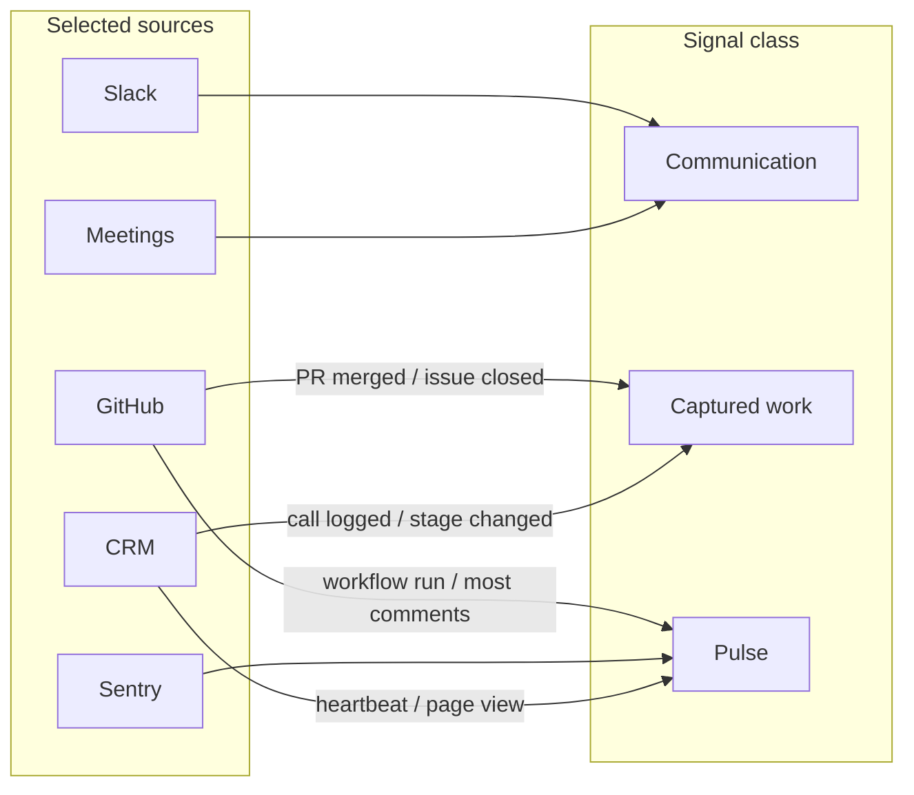
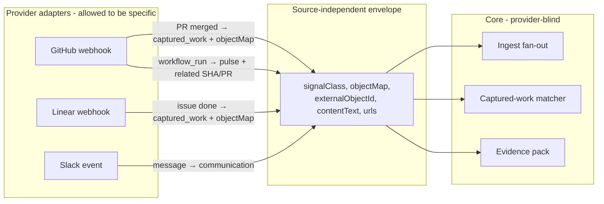
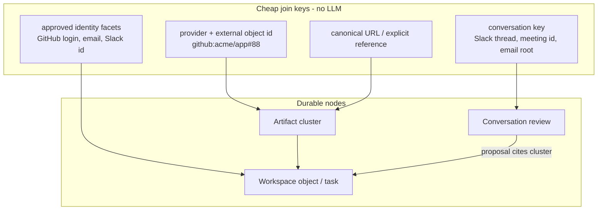
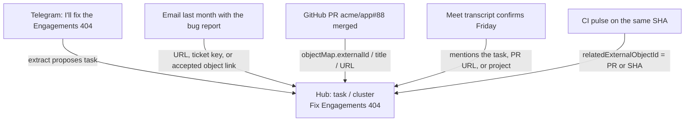
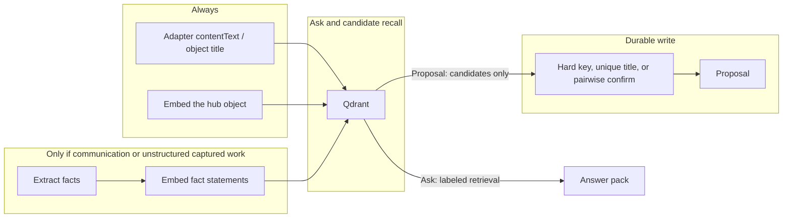
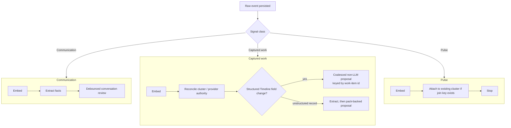
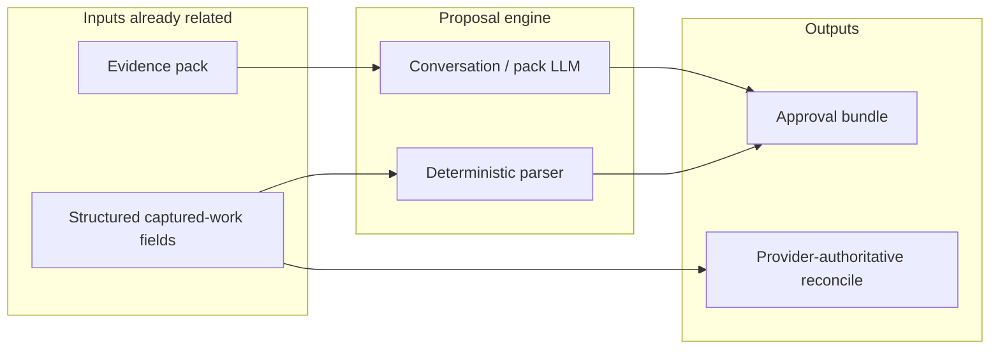
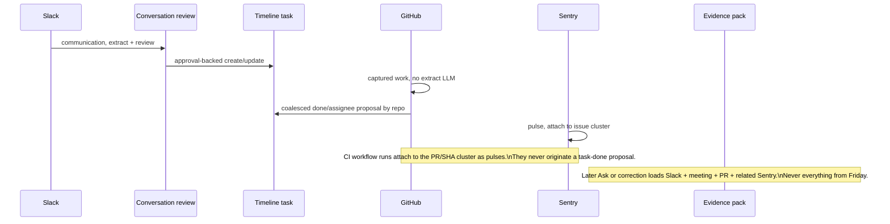

# Relational operating memory

**Status:** Architecture contract. Parts are shipped; the classifier and
pack-backed consumers are not finished.

**Audience:** Product, engineering, and anyone changing ingest, proposals,
retrieval, or object memory.

**Last updated:** 2026-08-17

Timeline's job is not "run an LLM over the firehose." It is to keep an
evidence-backed working history, relate events that are about the same real
work, and spend model calls only where they change a decision.

This document is the contract for that system. Cross-source packs
([`cross-source-evidence.md`](./cross-source-evidence.md),
[ADR 0014](./adr/0014-cross-source-evidence-packs-use-policy-bound-related-evidence.md))
are the bounded read primitive. Artifact clusters
([ADR 0005](./adr/0005-workspace-reconciliation-is-artifact-centered-and-approval-backed.md))
are the consistency boundary. Approval-backed objects
([ADR 0003](./adr/0003-object-memory-is-approval-backed-workspace-state.md))
are the durable write. Signal class decides what an event is *allowed to
spend* on the way in.

## The problem

A GitHub org, a Slack workspace, a Sentry project, and a meeting bot do not
produce the same kind of evidence. A merged PR, a CI run, and a standup
message can all mention the same ticket. Only some of those events should be
allowed to change Timeline memory. Almost none of them should be concatenated
into a prompt because they happened in the same hour.

Time-window context fails in both directions:

- Unrelated pulses share a minute with a real decision.
- Related captured work is often days or weeks apart from the conversation
  that created the Timeline task.

Dumping the firehose into extract or suggestion models is also the wrong cost
model. GitHub and Sentry are high-volume structured streams. They are useful
as evidence. They are expensive and low-yield as free-text extraction.

## The thesis

Every selected source plays a role. Not every source pays for a model call.

1. **Classify the event, not the integration.** GitHub is not one behavior.
   A merged PR is captured work. A workflow run is a pulse. A review comment
   is communication-lite attached to captured work.
2. **Relations attach to shared hubs, not to a surface.** Provider ids,
   conversation keys, and URLs are how an event finds a cluster or object.
   Telegram, a PR, a meeting, and last month's email meet because they all
   point at the same hub, not because they share a provider. Embeddings
   recall candidate hubs. They do not prove the link.
3. **LLMs read bounded packs of already-related evidence.** They do not
   discover the graph by dumping sources together. Semantic search may rank
   eligible rows and may answer questions. It does not admit a pulse into a
   durable proposal.
4. **Durable inferred memory stays approval-backed.** A provider may update
   fields it authoritatively owns. Timeline-owned tasks, notes, owners, and
   object memory do not silently rewrite themselves from a webhook.

```text
capture surfaces
       |
       v
 immutable raw events
       |
       v
 signal class + cheap processing
 persist, embed, hard-anchor
       |
       v
 relation graph
 clusters, objects, conversations, provider ids
       |
       v
 bounded evidence pack
 visibility-safe, one-hop, budgeted
      /        \
 answers      proposals
 retrieval    durable writes
```

## Signal classes

Class is a property of the **event**, not the OAuth app. One provider can emit
all three.

| Class | What it is | Examples | Default job |
| --- | --- | --- | --- |
| **Communication** | People talking, deciding, committing | Slack/Telegram threads, meetings, email, voice notes, PR review discussion | Persist, embed, extract facts, conversation review |
| **Captured work** | A durable work record or lifecycle change | Merged PR, closed issue, Linear/Jira status, Monday item, CRM call log, signed contract | Persist, embed, reconcile; structured proposal only when Timeline memory should move |
| **Pulse** | A telemetry or heartbeat event that can explain or impact work | CI runs, Sentry events, deploy pings, noisy issue-alert repeats, most comments that are not a decision | Persist, embed, attach as supporting evidence; never originate a proposal |

Communication and captured work are the clearest signals. Pulses are not
noise — a failing workflow or a Sentry spike can be the reason a PR stalled —
but they are supporting context, not a license to mint tasks.

Unstructured captured work (a CRM call log, a forwarded client email that is
really a work record) may still extract. Structured captured work (PR merged,
issue closed, Linear state) must not. Pulses never extract.



## Source-independent envelope

The core must not switch on `provider === 'github'`. GitHub-specific parsing
belongs in the GitHub adapter, the same way Linear parsing belongs in the
Linear adapter. Independence is preserved when every adapter emits the same
envelope and the rest of the system only reads that envelope.

The envelope already exists in spirit as `IntegrationEvent`:

| Field | Independent meaning | GitHub PR | GitHub CI |
| --- | --- | --- | --- |
| `signalClass` (target) | Spend and proposal rights | `captured_work` | `pulse` |
| `objectMap` | Durable work record, if any | `type=task`, `externalId=repo#88`, `status=done` | absent |
| `externalObjectId` | Stable subject of this event | `acme/app#88` | `acme/app#workflow_run:123` |
| `relatedExternalObjectId` (target) | Work item this pulse attaches to | — | PR or SHA when known |
| `contentText` | Human-facing narrative to embed | `GitHub PR acme/app#88 — Fix Engagements 404` | `GitHub workflow CI #12 failed on acme/app` |
| `url` / aliases | Cross-source join bait | `https://github.com/acme/app/pull/88`, `PR-acme/app-88` | workflow URL, `head_sha` |

Today the GitHub adapter already does this split: PRs and issues carry
`objectMap`; workflow runs do not. The leak is that proposal code then
re-parses `github.type` in shared code. The target is: **adapters classify
and map; the proposal engine matches `objectMap` + `signalClass` + status
the same way for GitHub, Linear, Jira, or a future CRM.**



Writing `if (github.type === 'pull_request')` in the suggestion worker is
what destroys independence. Writing it once in `providers/github.ts` is the
adapter doing its job.

## Cost law

Model spend is reserved for decisions. Indexing is reserved for everything
selected.

| Spend | Allowed | Forbidden |
| --- | --- | --- |
| Persist + visibility + source snapshot | All selected events | Dropping a selected source because it is noisy |
| Embed, rate-limited per connection | All selected events | Skipping embeddings for pulses so Ask cannot find them |
| Hard-anchor into a cluster / object | Any event with a stable id, URL, or conversation key | Creating a new object from a pulse |
| Extract LLM | Communication; unstructured captured work | Pulses; structured captured work |
| Suggestion / conversation-review LLM | Communication; pack-backed corrections | Pulses; parser-complete lifecycle fields |
| Structured non-LLM proposal | Captured-work field changes Timeline should review | Using this path for CI, Sentry, or comments |
| Answer LLM | Viewer-visible Ask / digest / handoff over a pack | Prompting with "last N events from this hour" |

Today's coarse gate `github | linear | monday | sentry` skip extract because
those providers are mostly structured. The target gate is **signal class +
payload shape**, so a future CRM note can extract while a future CRM
heartbeat cannot, and a GitHub review discussion can be treated as
communication attached to a PR without extracting every `workflow_run`.

Per-connection ingest rate limits stay in front of extract, embed, and
coalesced proposal jobs. They are a fuse, not a classifier.

## Relation graph

The graph is how related work finds itself without a time window.



Qualifying relationships for a **proposal pack** are direct and one-hop
([ADR 0014](./adr/0014-cross-source-evidence-packs-use-policy-bound-related-evidence.md)):

- same conversation
- canonical artifact or object association
- provider or external id
- canonical URL or explicit reference
- human-curated object link

A model-extracted fact may *create a candidate*, but it cannot *qualify* that
candidate by itself. Semantic similarity never admits proposal evidence.

Pulses use the same join keys. A Sentry issue attaches to the incident
cluster. A workflow run attaches to the PR or SHA cluster via
`relatedExternalObjectId`. They become supporting evidence when a later
communication or captured-work review asks for a pack. They do not start
that review.

### Cross-source stories need a hub

Same-surface keys are not enough for "Telegram + GitHub PR + Google Meet +
an email from last month." Those four never share a conversation key or a
provider id. They share a **hub**: a Timeline task, project, person, or
artifact cluster.



How the first link gets created, cheapest first:

1. **Explicit reference.** A URL, `acme/app#88`, `ENG-42`, or an accepted
   object mention in the text. Parse without an LLM when the pattern is
   stable. This is the best cross-source join.
2. **Object already exists.** Communication extract created a task last
   week. Captured work later matches it by provider id, alias, or a unique
   title. The GitHub `done` proposal already does this match. That is
   cross-source without vectors.
3. **Deterministic rendered titles.** Structured events already have a
   standard form: `task: acme/app#88: Fix command palette Engagements route
   404`. Embed that, not the webhook JSON. Slack "Engagements 404" can
   retrieve the object. Lexical overlap is a recall hint, still not a write
   proof.
4. **Vector recall, then qualify.** When there is no URL and no unique
   title, embeddings retrieve *candidates*. A second step must qualify:
   shared object, shared URL, unique title, or one pairwise "are these the
   same work item?" check on the shortlist. Never promote cosine similarity
   alone into a durable link.

The email from last month joins the story when it already pointed at the
bug, the URL, the customer, or the project — or when Ask retrieves it as
**labeled semantic evidence**. A proposal still cannot use it until a hard
link exists. That is the difference between "the full story for a human
question" and "rewrite Timeline memory."

## Embeddings: recall, not a second source of truth

Do not LLM-summarize every event into a canonical paragraph just to make
Telegram and GitHub comparable. That is a second extract pass on the
firehose. Pulses would dominate the bill and still would not be safe write
keys.

What to embed instead:

| Source | Embed this | Extra LLM rewrite? |
| --- | --- | --- |
| Structured captured work | Deterministic `contentText` + `objectMap.canonicalName` | No. The adapter already wrote the standard form. |
| Pulse | Short human-facing `contentText` plus parent work-item id when known | No. |
| Communication | The message or transcript (`renderRawEventForAi`) | No extra summarizer. |
| Extracted facts | The fact statement, already a standard sentence | Reuse extract. Do not summarize again. |
| Workspace objects / clusters | `type: canonicalName` plus aliases | No. This hub embedding is the cross-source translator. |

The comparable "standard form" is **the hub object's name and aliases**,
plus the adapter's human-facing `contentText`. A PR and a Telegram note
relate because both can hit `task: Fix command palette Engagements route
404`, not because we asked a model to rewrite the webhook into a poem.

When extract already ran for communication, its fact statements and linked
entities *are* the LLM-created embeddable text. Pay that cost once, on the
signal class that earned it.



There is no cheaper option that still finds last month's email: you must
index it. There is a much more expensive option that still fails as a write
key: summarize every CI run and hope cosine equals "same work." Index
everything selected. Summarize only the classes that already pay for
extract. Confirm cross-source writes with a hub, not with a vibe.

## Ingest fan-out



Coalescing is by **work-item id**, not by clock. A burst of PR events for
`acme/app#88` collapses into one delayed job that loads the latest
team-visible event for that id. Unrelated PRs in the same minute do not share
a prompt. The same PR from last week is still findable because the id did not
move.

## Proposal engine

Proposals are how inferred Timeline memory moves. They are not how providers
update fields they own.



Rules:

- **Communication** proposes through a conversation review and, once migrated,
  a proposal-policy pack. Isolated Slack messages do not mint tasks
  ([ADR 0004](./adr/0004-conversation-reviews-drive-conversational-proposals.md)).
- **Captured work** proposes only when a Timeline-owned field should change
  (task `done`, assignee, aliases). Provider-owned cluster status can move
  without a suggestion model. GitHub merged PR → Timeline task `done` is this
  path: parse fields, match an existing open task, write an approval bundle.
- **Pulses** never originate bundles. They may appear as supporting citations
  inside a pack started by communication or captured work.
- Every proposed item names exact raw-event ids from the supplied pack or the
  structured source event. Empty, hidden, or invented citations invalidate
  the bundle.
- Accepted memory is canonical until a new proposal is accepted. Pending
  bundles may merge or supersede as related evidence arrives.

Vectors do not sit on this write path as a join key. Stored embeddings may
tie-break already-qualified pack candidates. Missing vectors skip the
tie-breaker; they never trigger a new embedding for ranking.

## Retrieval and generated communication

Ask, digests, and handoffs are readers of the same graph.

| Consumer | Admission | Why |
| --- | --- | --- |
| Proposal pack | Direct one-hop only | A weak similarity must not rewrite memory |
| Answer pack | Viewer-visible semantic matches allowed, labeled as retrieval | Questions need recall; they do not change canonical state |
| Digest / handoff | Pack plus typed adjacent objects, tasks, calendar | Generated communication is cited memory, not a new source of truth |

Pulses are first-class for Ask ("why did the release fail?") and for moment
bundling on the timeline. They stay second-class for approvals.

## Durable objects

The write model does not change with signal class.

- **Raw events stay immutable.** Derived associations, rankings, and proposals
  may change.
- **Artifact clusters** exist before a canonical object. A Sentry issue, a
  GitHub PR, and a Slack commitment can share a cluster without each source
  being allowed to change canonical state.
- **Workspace objects and tasks** are approval-backed when Timeline infers
  the change. Provider-owned fields follow authority policy.
- **Provenance is tiered:** why the artifact exists, what changed it, and
  related observed evidence ([ADR 0010](./adr/0010-artifact-provenance-is-tiered-and-evidence-backed.md)).

Pulses thicken the "related observed evidence" tier. They do not become the
reason the object exists.

## Worked example

Slack: "I'll land the Engagements 404 fix in audit-ai today."
Meeting: confirms Friday.
GitHub: PR `timborovkov/audit-ai#88` merges.
Sentry: login crash in the same release spikes, then resolves.
CI: workflow runs go red, then green.



What must not happen:

- Extract every GitHub and Sentry row with "5 recent events" as context.
- Mark the Timeline task done because a workflow run finished in the same
  minute.
- Assign the task to whoever connected GitHub.
- Drop Sentry so the later "why did this regress?" question has no evidence.

## What is shipped vs target

| Piece | Today | Target |
| --- | --- | --- |
| Immutable ingest + team isolation | Shipped | Unchanged |
| Embed every selected integration event, rate-limited | Shipped | Unchanged |
| Skip extract/suggestion LLM for GitHub, Linear, Monday, Sentry | Shipped as a provider list | Replace with signal class + payload shape |
| GitHub PR/issue lifecycle → coalesced task proposals | Shipped | Template for other captured-work providers |
| Artifact clusters + authority policy | Shipped | Pulses attach; they do not gain authority |
| Conversation reviews for Slack/Telegram | Shipped | Migrate onto proposal packs |
| Evidence-pack builder | Implemented, default off | Enforced per adapter after gates |
| First-class signal-class field on ingest | Not shipped | Classifier at write time, inspectable on the envelope |
| Provider-blind captured-work matcher | GitHub-specific parser in shared code | Match `objectMap` + status + aliases for any adapter |
| Pulse parent work-item id | Partial (`head_sha` in metadata, not a core field) | `relatedExternalObjectId` on the envelope |
| LLM rewrite of every event for embedding | Not done, and must not be | Reuse extract facts + object titles only |
| Pulse-as-supporting-evidence in proposal packs | Partial (eligible as integration evidence, not a class policy) | Explicit admission as supporting only |
| Time-window extract context for Slack/Drive | Still used as local conversation hint | Keep only inside a conversation key, never across providers |

## Non-negotiables

1. Classify by event, not by OAuth app. Core code reads the envelope, not
   `provider === 'github'`.
2. Do not use time windows or embedding similarity as proposal join keys.
   Embeddings recall; hubs qualify.
3. Pulses never originate proposals and never call extract.
4. Structured captured work never calls extract or the suggestion model.
5. Communication still requires a conversation review or pack, not one
   isolated message.
6. Team isolation and visibility apply before retrieval, ranking, model
   input, persistence, and display.
7. A pack supplies evidence, not authority.
8. Every proposed Timeline-owned change is approval-backed and cited.
9. Do not add a second LLM summarizer on ingest to make sources "more
   embeddable." Adapters already emit human-facing `contentText`. Extract
   already emits fact statements for the classes that pay for it.

## Implementation seams

When code changes ingest or proposals, update this file in the same change.

- Classifier target: adapters set `signalClass` (and parent
  `relatedExternalObjectId` for pulses) on the existing `IntegrationEvent`
  envelope. Shared ingest and proposal code must not switch on provider
  name.
- Captured-work proposals: today's GitHub parser in
  `packages/shared/src/integrations/github-task-proposals.ts` is the first
  slice. The target matcher reads `objectMap` + status + aliases for any
  provider.
- Embeddings: `renderRawEventForAi` plus object/fact embeddings. No ingest
  summarizer job.
- Packs: `docs/cross-source-evidence.md` and ADR 0014 remain the admission
  and citation contract.
- Cost fuses: `RATE_LIMITS.integrationExtract`, `integrationEmbed`, and
  `integrationGithubTaskProposal` in
  `packages/shared/src/rate-limit/buckets.ts`.

## Open work this contract implies

- Lift the provider skip list into an event-level signal class on the
  envelope.
- Replace GitHub-specific proposal parsing in shared code with an
  envelope-driven captured-work matcher.
- Treat GitHub review discussion as communication attached to a PR cluster,
  not as another extract firehose and not as a task-done parser.
- Set pulse parent ids (`relatedExternalObjectId`) so CI/Sentry attach to
  the work-item hub without provider switches in core.
- Let pulses into proposal packs only as supporting evidence when a hard join
  key already exists.
- Reuse the captured-work proposal template for Linear/Jira-style status and
  assignee fields without an LLM.
- Keep CRM, contracts, and call logs on the captured-work path even when the
  payload is unstructured enough to extract.
- Stop describing GitHub, Sentry, Linear, or Monday as "going through the
  suggestion model."
- Do not add an ingest summarizer whose only job is prettier embeddings.
